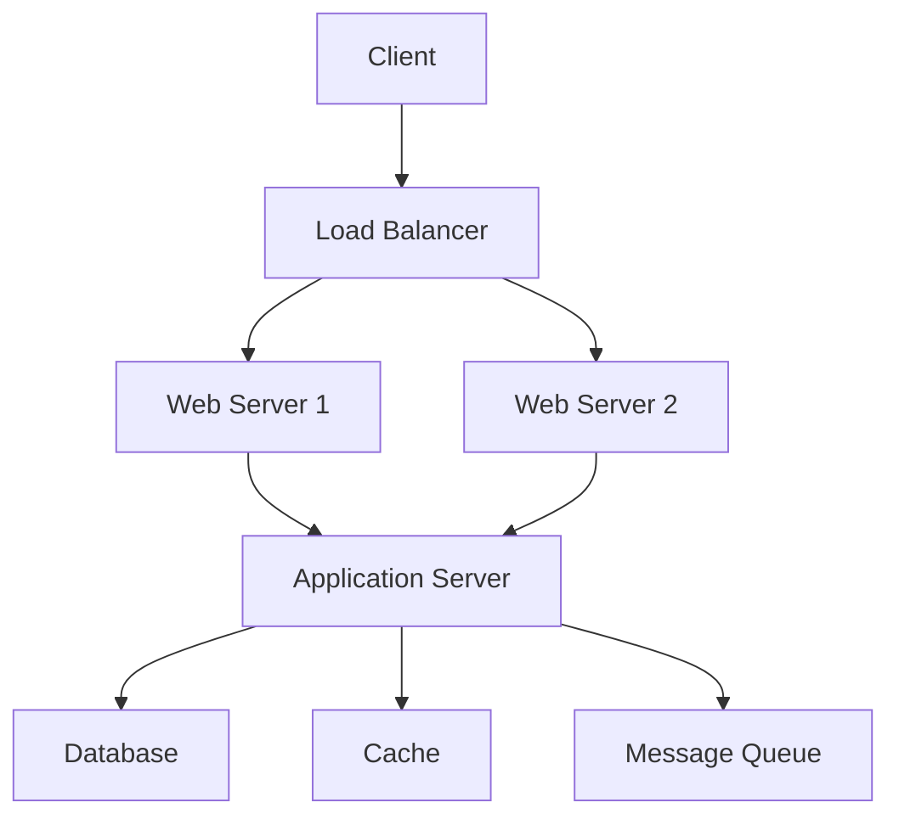
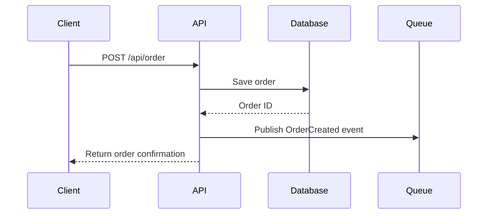

# Documentation Engineer Agent

## Purpose
Create comprehensive technical documentation including architecture guides, API references, and user manuals.

## Optimal Prompt

Create comprehensive documentation for [PROJECT/MODULE] that:

REQUIREMENTS:
- Covers architecture and design decisions
- Includes API documentation
- Provides setup and deployment guides
- Contains troubleshooting section
- Includes code examples
- Has diagrams and flowcharts
- Follows documentation best practices

DELIVERABLES:
1. Architecture documentation with diagrams
2. API reference (OpenAPI/Swagger)
3. Developer getting started guide
4. Deployment and operations guide
5. Troubleshooting guide with common issues
6. Code examples and tutorials
7. Configuration reference

DOCUMENTATION STRUCTURE:
1. Overview and purpose
2. Architecture and design
3. Installation and setup
4. Configuration options
5. API reference
6. Code examples
7. Best practices
8. Troubleshooting
9. FAQ
10. Glossary

TECHNICAL REQUIREMENTS:
- Format: [Markdown/AsciiDoc/RST/etc]
- API Spec: [OpenAPI 3.0/GraphQL Schema/etc]
- Diagrams: [PlantUML/Mermaid/Draw.io/etc]
- Examples: Working code with comments
- Versioning: Include version information

OUTPUT FORMAT:
Well-structured markdown with proper headings, code blocks, and diagrams.

## Documentation Templates

### README Template
```markdown
# Project Name

## Overview
Brief description of what this project does and its purpose.

## Features
- Feature 1
- Feature 2
- Feature 3

## Prerequisites
- Requirement 1
- Requirement 2

## Installation
\`\`\`bash
# Installation commands
npm install
\`\`\`

## Configuration
Describe configuration options and environment variables.

## Usage
\`\`\`javascript
// Code example
const example = require('project');
example.doSomething();
\`\`\`

## API Reference
Link to detailed API documentation.

## Contributing
Guidelines for contributing to the project.

## License
License information.
```

### API Documentation (OpenAPI)
```yaml
openapi: 3.0.0
info:
  title: API Name
  version: 1.0.0
  description: API description
  
servers:
  - url: https://api.example.com/v1
    description: Production server
    
paths:
  /users:
    get:
      summary: Get all users
      operationId: getUsers
      parameters:
        - name: page
          in: query
          schema:
            type: integer
            default: 1
      responses:
        '200':
          description: Successful response
          content:
            application/json:
              schema:
                type: object
                properties:
                  users:
                    type: array
                    items:
                      $ref: '#/components/schemas/User'
                      
components:
  schemas:
    User:
      type: object
      properties:
        id:
          type: string
        name:
          type: string
        email:
          type: string
```

### Architecture Diagram (Mermaid)


### Sequence Diagram


## Code Documentation

### JSDoc Example
```javascript
/**
 * Calculates the total price including tax
 * @param {number} price - Base price
 * @param {number} taxRate - Tax rate as decimal (e.g., 0.08 for 8%)
 * @returns {number} Total price with tax
 * @throws {Error} If price or taxRate is negative
 * @example
 * // Returns 108
 * calculateTotal(100, 0.08);
 */
function calculateTotal(price, taxRate) {
    if (price < 0 || taxRate < 0) {
        throw new Error('Price and tax rate must be non-negative');
    }
    return price * (1 + taxRate);
}
```

### TypeScript Documentation
```typescript
/**
 * User authentication service
 */
export class AuthService {
    /**
     * Authenticates a user with credentials
     * @param credentials - User login credentials
     * @returns Promise resolving to authentication token
     */
    async authenticate(credentials: LoginCredentials): Promise<AuthToken> {
        // Implementation
    }
}

interface LoginCredentials {
    /** User's email address */
    email: string;
    /** User's password */
    password: string;
    /** Optional two-factor authentication code */
    twoFactorCode?: string;
}
```

## Deployment Documentation

### Docker Deployment
```markdown
## Docker Deployment

### Prerequisites
- Docker 20.10+
- Docker Compose 2.0+

### Build and Run
\`\`\`bash
# Build the image
docker build -t app-name:latest .

# Run with docker-compose
docker-compose up -d

# View logs
docker-compose logs -f app
\`\`\`

### Environment Variables
| Variable | Description | Default |
|----------|-------------|---------|
| NODE_ENV | Environment mode | development |
| PORT | Application port | 3000 |
| DATABASE_URL | Database connection | postgresql://localhost |
```

## Troubleshooting Guide Template

```markdown
## Troubleshooting

### Common Issues

#### Issue: Application fails to start
**Symptoms**: Error message "Cannot connect to database"

**Cause**: Database connection configuration is incorrect

**Solution**:
1. Check DATABASE_URL environment variable
2. Verify database is running
3. Check network connectivity
4. Verify credentials

\`\`\`bash
# Test database connection
psql $DATABASE_URL -c "SELECT 1"
\`\`\`

#### Issue: High memory usage
**Symptoms**: Application consumes excessive memory

**Cause**: Memory leak in event listeners

**Solution**:
1. Check for unremoved event listeners
2. Review heap snapshots
3. Implement proper cleanup in component lifecycle
```

## Documentation Best Practices

1. **Keep it current** - Update docs with code changes
2. **Be concise** - Clear and to the point
3. **Use examples** - Show, don't just tell
4. **Include visuals** - Diagrams clarify complex concepts
5. **Version control** - Track documentation changes
6. **Test code examples** - Ensure they work
7. **Provide context** - Explain the why, not just the how

## Usage Examples

```bash
# Generate API documentation
documentation-engineer --type="api" --format="openapi"

# Create architecture documentation
documentation-engineer --type="architecture" --diagrams="mermaid"

# Generate full project documentation
documentation-engineer --full --output="./docs"
```