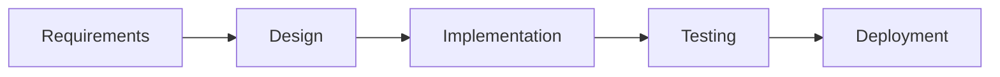
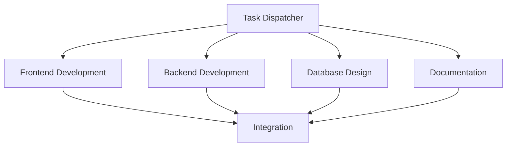
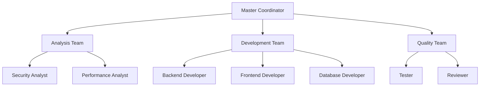
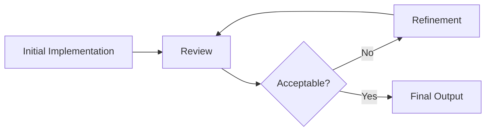
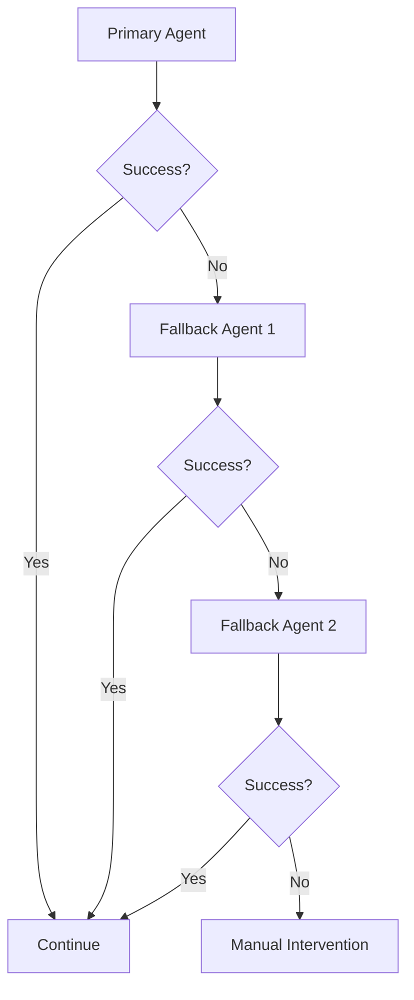

# Subagent Composition Strategies

## Overview
This guide explains how to effectively chain and compose multiple subagents to handle complex, multi-faceted development tasks. Learn when to run agents in parallel, sequence, or hierarchical patterns for optimal results.

## Composition Patterns

### 1. Sequential Pipeline
**When to use**: Tasks have dependencies and must be completed in order



**Example: Complete Feature Implementation**
```yaml
pipeline:
  - stage: analysis
    agent: backend-analyzer
    prompt: "Analyze existing payment system architecture and identify integration points for Stripe"
    output: architecture_analysis.md
    
  - stage: design
    agent: database-architect
    prompt: "Design schema for payment transactions based on {{architecture_analysis}}"
    output: payment_schema.sql
    
  - stage: backend
    agent: backend-service-builder
    prompt: "Implement Stripe payment service with schema {{payment_schema}}"
    output: payment_service.code
    
  - stage: frontend
    agent: frontend-architect
    prompt: "Create payment UI components integrated with {{payment_service}} endpoints"
    output: payment_components.code
    
  - stage: testing
    agent: test-automation-engineer
    prompt: "Create test suite for payment flow covering {{payment_service}} and {{payment_components}}"
    output: payment_tests.code
    
  - stage: documentation
    agent: documentation-engineer
    prompt: "Document payment system including {{payment_service}} API and {{payment_components}} usage"
    output: payment_docs.md
    
  - stage: context_maintenance
    agent: context-gardener
    prompt: "Update CONTEXT.md files for payment module and cross-references"
    output: updated_contexts.md
```

### 2. Parallel Execution
**When to use**: Independent tasks that can run simultaneously



**Example: Multi-Layer Development**
```yaml
parallel_tasks:
  frontend:
    agent: frontend-architect
    prompt: "Build React dashboard with charts, filters, and export functionality"
    
  backend:
    agent: backend-service-builder
    prompt: "Create REST API for dashboard data aggregation and filtering"
    
  database:
    agent: database-architect
    prompt: "Design optimized schema for dashboard analytics with proper indexes"
    
  tests:
    agent: test-automation-engineer
    prompt: "Develop test framework and initial test cases for dashboard"
    
  context_maintenance:
    agent: context-gardener  
    prompt: "Create/update CONTEXT.md files for new dashboard modules"

integration:
  agent: general-purpose
  prompt: "Integrate {{frontend}}, {{backend}}, and {{database}} components"
  depends_on: [frontend, backend, database, context_maintenance]
```

### 3. Hierarchical Orchestration
**When to use**: Complex tasks requiring coordination and decision-making



**Example: Large Feature with Coordination**
```yaml
orchestration:
  coordinator:
    agent: general-purpose
    role: "Project coordinator for e-commerce checkout feature"
    responsibilities:
      - Decompose requirements
      - Assign tasks to specialists
      - Integrate results
      - Handle conflicts
    
  teams:
    analysis:
      - agent: security-auditor
        task: "Analyze security requirements for checkout"
      - agent: performance-optimizer
        task: "Define performance benchmarks"
    
    development:
      - agent: backend-service-builder
        task: "Build checkout API with {{security_requirements}}"
      - agent: frontend-architect
        task: "Create checkout UI meeting {{performance_benchmarks}}"
      - agent: database-architect
        task: "Design order and payment schemas"
    
    quality:
      - agent: test-automation-engineer
        task: "Test all checkout scenarios"
      - agent: code-reviewer
        task: "Review all implementation code"
```

### 4. Iterative Refinement
**When to use**: Tasks requiring multiple rounds of improvement



**Example: Performance Optimization Loop**
```yaml
iteration:
  max_iterations: 3
  target_metric: "response_time < 100ms"
  
  loop:
    - measure:
        agent: performance-optimizer
        prompt: "Profile current performance and identify bottlenecks"
        output: performance_report
    
    - analyze:
        agent: backend-analyzer
        prompt: "Analyze {{performance_report}} and suggest optimizations"
        output: optimization_plan
    
    - implement:
        agent: general-purpose
        prompt: "Implement optimizations from {{optimization_plan}}"
        output: optimized_code
    
    - validate:
        agent: test-automation-engineer
        prompt: "Test {{optimized_code}} and measure performance"
        output: test_results
    
    - decide:
        condition: "{{test_results.response_time}} < 100ms"
        true: exit
        false: continue
```

### 5. Fallback Chain
**When to use**: Handling failures with alternative approaches



**Example: Robust Error Handling**
```yaml
fallback_chain:
  primary:
    agent: microservice-architect
    prompt: "Auto-generate microservice from OpenAPI spec"
    timeout: 300s
    
  fallback_1:
    agent: backend-service-builder
    prompt: "Build service manually from OpenAPI spec"
    condition: "primary.failed || primary.timeout"
    
  fallback_2:
    agent: general-purpose
    prompt: "Create basic service scaffold for manual completion"
    condition: "fallback_1.failed"
    
  alert:
    condition: "all.failed"
    action: "Notify human developer for assistance"
```

## Advanced Composition Strategies

### 1. Map-Reduce Pattern
**When to use**: Processing multiple similar items

```yaml
map_reduce:
  map:
    agent: code-reviewer
    items: ["module_1.js", "module_2.js", "module_3.js"]
    prompt_template: "Review {{item}} for security vulnerabilities"
    parallel: true
    
  reduce:
    agent: documentation-engineer
    prompt: "Consolidate all review findings into security report"
    input: "{{map.results}}"
```

### 2. Conditional Branching
**When to use**: Different paths based on conditions

```yaml
conditional:
  condition_check:
    agent: backend-analyzer
    prompt: "Analyze if system uses microservices or monolithic architecture"
    
  branches:
    microservices:
      condition: "{{condition_check.result}} == 'microservices'"
      agent: microservice-architect
      prompt: "Add new service to existing architecture"
      
    monolithic:
      condition: "{{condition_check.result}} == 'monolithic'"
      agent: backend-service-builder
      prompt: "Add new module to monolithic application"
```

### 3. Recursive Decomposition
**When to use**: Breaking down complex problems

```yaml
recursive:
  decompose:
    agent: general-purpose
    prompt: "Break down 'Build CRM system' into subtasks"
    
  process_subtasks:
    for_each: "{{decompose.subtasks}}"
    do:
      if: "{{subtask.is_complex}}"
      then: 
        recurse: decompose
        with: "{{subtask}}"
      else:
        agent: "{{subtask.suggested_agent}}"
        prompt: "{{subtask.description}}"
```

### 4. Consensus Pattern
**When to use**: Multiple agents validate result

```yaml
consensus:
  implementations:
    - agent: backend-service-builder
      prompt: "Implement user authentication service"
      
    - agent: microservice-architect
      prompt: "Implement user authentication service"
      
    - agent: general-purpose
      prompt: "Implement user authentication service"
      
  validation:
    agent: code-reviewer
    prompt: "Compare implementations and identify best approach"
    
  final:
    agent: general-purpose
    prompt: "Merge best aspects of all implementations"
```

## Composition Templates

### Template 1: Full Stack Feature
```yaml
name: "Full Stack Feature Development"
stages:
  1_requirements:
    agent: general-purpose
    prompt: "Analyze requirements and create technical specification"
    
  2_api_design:
    agent: documentation-engineer
    prompt: "Create OpenAPI specification from requirements"
    
  3_database:
    agent: database-architect
    prompt: "Design database schema for feature"
    
  4_backend:
    agent: backend-service-builder
    prompt: "Implement API from OpenAPI spec"
    
  5_frontend:
    agent: frontend-architect
    prompt: "Build UI components for feature"
    
  6_integration:
    agent: general-purpose
    prompt: "Integrate frontend with backend"
    
  7_testing:
    parallel:
      - agent: test-automation-engineer
        prompt: "Create backend tests"
      - agent: test-automation-engineer
        prompt: "Create frontend tests"
      - agent: test-automation-engineer
        prompt: "Create e2e tests"
        
  8_documentation:
    agent: documentation-engineer
    prompt: "Create user and developer documentation"
    
  9_deployment:
    agent: devops-automator
    prompt: "Create deployment pipeline"
```

### Template 2: Bug Fix Workflow
```yaml
name: "Bug Fix Process"
stages:
  1_reproduce:
    agent: test-automation-engineer
    prompt: "Create test to reproduce bug {{bug_report}}"
    
  2_analyze:
    agent: backend-analyzer
    prompt: "Analyze root cause of failing test"
    
  3_fix:
    agent: general-purpose
    prompt: "Implement fix for root cause"
    
  4_verify:
    agent: test-automation-engineer
    prompt: "Verify fix and check for regressions"
    
  5_review:
    agent: code-reviewer
    prompt: "Review fix for quality and side effects"
    
  6_document:
    agent: documentation-engineer
    prompt: "Document bug fix and update changelog"
```

### Template 3: Performance Improvement
```yaml
name: "Performance Optimization"
stages:
  1_baseline:
    agent: performance-optimizer
    prompt: "Establish performance baseline metrics"
    
  2_profile:
    parallel:
      - agent: performance-optimizer
        prompt: "Profile backend performance"
      - agent: performance-optimizer
        prompt: "Profile frontend performance"
      - agent: database-architect
        prompt: "Analyze database query performance"
        
  3_optimize:
    parallel:
      - agent: backend-service-builder
        prompt: "Optimize backend based on profiling"
      - agent: frontend-architect
        prompt: "Optimize frontend based on profiling"
      - agent: database-architect
        prompt: "Optimize queries and indexes"
        
  4_validate:
    agent: performance-optimizer
    prompt: "Measure improvements against baseline"
    
  5_document:
    agent: documentation-engineer
    prompt: "Document optimizations and new metrics"
    
  6_context_update:
    agent: context-gardener
    prompt: "Update CONTEXT.md files with performance improvements and new constraints"
```

### Template 4: Context Maintenance Workflow
```yaml
name: "Documentation Context Maintenance"
description: "Proactive documentation maintenance using organic growth principles"
stages:
  1_scan:
    agent: context-gardener
    prompt: "Scan codebase for contexts needing creation, updates, or splitting"
    output: context_analysis.md
    
  2_create:
    parallel:
      - agent: context-gardener
        prompt: "Create CONTEXT.md for new modules with 3+ files"
        condition: "{{context_analysis.new_modules}} != null"
      - agent: context-gardener  
        prompt: "Split oversized CONTEXT.md files (>500 lines)"
        condition: "{{context_analysis.oversized_contexts}} != null"
        
  3_update:
    parallel:
      - agent: context-gardener
        prompt: "Update contexts affected by recent code changes"
        input: "{{recent_commits}}"
      - agent: context-gardener
        prompt: "Refresh cross-references between project modules"
        
  4_validate:
    agent: context-gardener
    prompt: "Validate context quality and completeness for project standards"
    
  5_prune:
    agent: context-gardener
    prompt: "Remove outdated contexts and consolidate related information"
    
# Trigger Conditions
triggers:
  post_feature: "After completing new module/feature development"
  weekly_maintenance: "Regular documentation hygiene"
  pre_release: "Before major releases to ensure currency"
  architecture_change: "After significant refactoring"
```

## Orchestration Best Practices

### 1. State Management
```yaml
state:
  global:
    project_context: "E-commerce platform"
    tech_stack: "Node.js, React, PostgreSQL"
    conventions: "link_to_conventions.md"
    
  pass_between_agents:
    - outputs as inputs
    - accumulated context
    - error states
    - metrics and logs
```

### 2. Error Handling
```yaml
error_handling:
  retry_policy:
    max_attempts: 3
    backoff: exponential
    
  failure_modes:
    timeout: 
      action: retry_with_different_agent
    error:
      action: log_and_continue
    critical:
      action: stop_pipeline
      
  recovery:
    checkpoint: save_state_after_each_stage
    rollback: restore_last_checkpoint
```

### 3. Communication Between Agents
```yaml
communication:
  format: JSON
  schema:
    input:
      context: object
      requirements: array
      constraints: array
      
    output:
      result: object
      metadata:
        confidence: number
        warnings: array
        suggestions: array
```

### 4. Quality Gates
```yaml
quality_gates:
  after_each_stage:
    - validation: output_schema_check
    - validation: business_rules_check
    - validation: security_scan
    - validation: context_documentation_current
    
  before_production:
    - gate: code_coverage > 80%
    - gate: no_critical_vulnerabilities
    - gate: performance_benchmarks_met
    - gate: documentation_complete
    - gate: contexts_up_to_date
    - gate: cross_references_valid
```

## Monitoring and Metrics

### Pipeline Metrics
```yaml
metrics:
  performance:
    - total_execution_time
    - stage_execution_times
    - parallel_efficiency
    - resource_utilization
    
  quality:
    - success_rate
    - error_rate
    - retry_count
    - fallback_usage
    
  output:
    - code_quality_score
    - test_coverage
    - documentation_completeness
    - security_score
    - context_freshness_score
    - cross_reference_accuracy
```

### Optimization Strategies
1. **Identify Bottlenecks**: Monitor stage execution times
2. **Parallelize When Possible**: Look for independent tasks
3. **Cache Results**: Reuse outputs from previous runs
4. **Fail Fast**: Add early validation stages
5. **Progressive Enhancement**: Start simple, add complexity

## Real-World Examples

### Example 1: Microservices Migration
```yaml
project: "Migrate monolith to microservices"
duration: "Multi-week project"

week_1:
  - agent: backend-analyzer
    task: "Analyze monolith and identify service boundaries"
  - agent: microservice-architect
    task: "Design target architecture"
    
week_2:
  parallel:
    - agent: database-architect
      task: "Design data separation strategy"
    - agent: api-gateway-designer
      task: "Design API gateway and routing"
    - agent: devops-automator
      task: "Setup Kubernetes infrastructure"
      
week_3_to_n:
  for_each_service:
    - agent: microservice-architect
      task: "Extract service from monolith"
    - agent: test-automation-engineer
      task: "Create service tests"
    - agent: devops-automator
      task: "Deploy service"
    - agent: general-purpose
      task: "Migrate traffic gradually"
```

### Example 2: Security Audit and Remediation
```yaml
project: "Comprehensive security improvement"

phase_1_audit:
  parallel:
    - agent: security-auditor
      task: "OWASP Top 10 assessment"
    - agent: security-auditor
      task: "Dependency vulnerability scan"
    - agent: security-auditor
      task: "Infrastructure security review"
      
phase_2_prioritize:
  agent: general-purpose
  task: "Prioritize findings by risk and effort"
  
phase_3_remediate:
  for_each_finding:
    if: "finding.priority == 'critical'"
    then:
      - agent: backend-service-builder
        task: "Implement security fix"
      - agent: test-automation-engineer
        task: "Create security test"
      - agent: code-reviewer
        task: "Review security fix"
        
phase_4_validate:
  agent: security-auditor
  task: "Re-run security audit to verify fixes"
  
phase_5_document:
  agent: documentation-engineer
  task: "Create security documentation and policies"
```

## Tips for Success

### 1. Start Simple
- Begin with sequential pipelines
- Add parallelization once working
- Introduce complex patterns gradually

### 2. Clear Interfaces
- Define input/output schemas
- Use consistent data formats
- Document agent dependencies

### 3. Monitoring
- Log all agent interactions
- Track success/failure rates
- Measure performance metrics

### 4. Iterative Improvement
- Analyze pipeline performance
- Identify optimization opportunities
- Refine agent prompts based on results

### 5. Documentation
- Document pipeline architecture
- Maintain runbooks for operations
- Share patterns with team