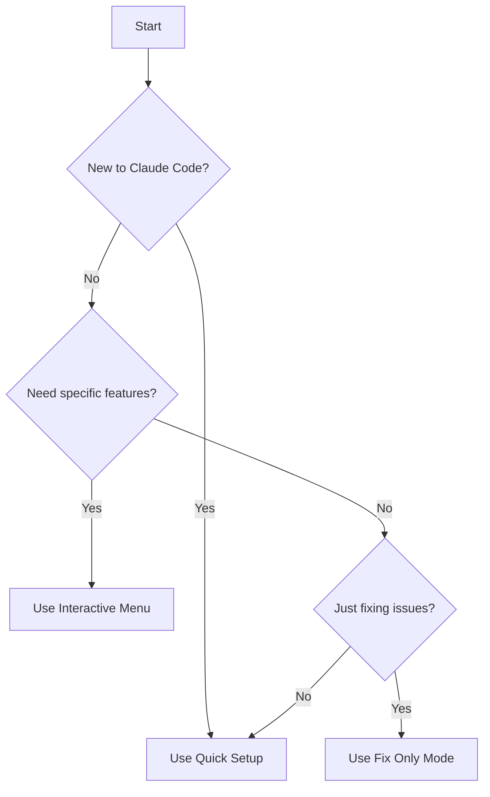

# 🚀 Claude Code Master Setup Guide

## 📋 Table of Contents
- [Prerequisites](#prerequisites)
- [Quick Start](#quick-start)
- [Setup Methods](#setup-methods)
- [Framework Detection](#framework-detection)
- [What Gets Configured](#what-gets-configured)
- [Verification](#verification)
- [Common Scenarios](#common-scenarios)
- [Troubleshooting](#troubleshooting)
- [Quick Reference](#quick-reference)

## 📦 Prerequisites

Before running setup, ensure you have:

| Requirement | Version | Check Command | Required For |
|------------|---------|---------------|--------------|
| **PowerShell** | 5.1+ | `$PSVersionTable.PSVersion` | All features |
| **Node.js** | 16+ | `node --version` | React/XOS projects |
| **.NET SDK** | 6+ | `dotnet --version` | Backend projects |
| **Git** | 2.30+ | `git --version` | Version control |
| **Admin Rights** | - | Run as Administrator | Hook installation |

## 🎯 Quick Start

**For most users, this single command handles everything:**

```powershell
powershell D:\Projects\CVS_Claude\claude_docs\master-setup.ps1 -QuickSetup
```

⏱️ **Time Required**: 30-60 seconds  
✅ **Success Rate**: 95% for standard projects

## 🔧 Setup Methods

### Which Method Should I Use?



### Method 1: Quick Setup (Recommended) ⭐

**Best for**: New projects, standard configurations

```powershell
# From your project directory
powershell D:\Projects\CVS_Claude\claude_docs\master-setup.ps1 -QuickSetup
```

**What it does**:
- ✅ Auto-detects framework
- ✅ Installs appropriate hooks (13 optimized validations)
- ✅ Creates CLAUDE.md documentation
- ✅ Fixes common issues automatically
- ✅ Sets up development environment

### Method 2: Interactive Menu 🎮

**Best for**: Custom configurations, selective setup

```powershell
# Launch interactive setup
powershell D:\Projects\CVS_Claude\claude_docs\master-setup.ps1
```

**Menu Options**:
| Option | Description | Time |
|--------|------------|------|
| **[1]** 🚀 Quick Setup | All recommended configs | 30-60s |
| **[2]** 🪝 Install Hooks | XOS validation rules | 10s |
| **[3]** 🗄️ Setup MCP | PostgreSQL tools | 20s |
| **[4]** 📋 Install Templates | UI components | 15s |
| **[5]** 📚 Create Docs | CLAUDE.md context | 5s |
| **[6]** 🛠️ Setup Environment | .gitignore, VSCode | 10s |
| **[7]** 🔧 Fix Issues | Common problems | 15s |
| **[8]** 🎯 Run ALL | Everything above | 2-3m |
| **[9]** 📊 View Status | Check setup state | 2s |
| **[Q]** ❌ Quit | Exit setup | - |

### Method 3: Fix Only Mode 🔧

**Best for**: Existing projects with issues

```powershell
powershell D:\Projects\CVS_Claude\claude_docs\master-setup.ps1 -FixOnly
```

**Fixes**:
- Phone regex in Utils.js
- Missing npm packages (react-color, fast-sort)
- Theme.css import issues
- Directory structure problems
- Port conflicts

## 🔍 Framework Detection

The setup script automatically detects your project type:

| Framework | Detection Method | Applied Configuration |
|-----------|-----------------|----------------------|
| **XOS** | `xos-components/` exists | MVVM hooks, component validation, theme checks |
| **React** | `package.json` with react | React hooks, modern patterns |
| **.NET** | `.csproj` files | Database configs, build hooks |
| **Node.js** | `package.json` exists | NPM scripts, dependency checks |
| **Generic** | None of above | Basic hooks, documentation |

## 📋 What Gets Configured

### 1. Claude Code Hooks (13 Validations)
```
✅ Component Validation    → Prevents XOSButton usage
✅ Theme CSS Check        → Ensures components are visible
✅ React Pattern Check    → Enforces MVVM over hooks
✅ ViewModel Validation   → Ensures proper inheritance
✅ Button Class Check     → XOS classes over Bootstrap
✅ Regex Validation       → Fixes Utils.js patterns
✅ Dependency Check       → Warns about missing packages
✅ VM File Check          → Ensures ViewModels exist
✅ Lifecycle Methods      → Uses XOS patterns
✅ Windows Path Check     → Validates path formats
✅ Linux Command Block    → Prevents WSL commands
✅ Build Failure Report   → Shows test/build errors
✅ File Access Tracking   → Logs modifications
```

### 2. Project Structure
```
YourProject/
├── .claude/
│   ├── settings.json        # Hook configuration
│   ├── mcp.json            # Database tools (if applicable)
│   └── logs/               # Activity tracking
├── CLAUDE.md               # AI context document
├── .gitignore             # Proper patterns
├── .vscode/
│   └── settings.json      # IDE optimization
└── src/
    ├── components/
    │   └── templates/     # UI templates (XOS/React)
    └── assets/
        └── css/          # Required for XOS
```

### 3. Fixed Issues
- ✅ Invalid phone regex patterns
- ✅ Missing npm dependencies
- ✅ Theme.css import problems
- ✅ Component visibility issues
- ✅ Build/test failures

## ✅ Verification

### Quick Verification
```powershell
# Check if setup succeeded
if (Test-Path ".claude/settings.json") { "✅ Hooks installed" } else { "❌ Hooks missing" }
if (Test-Path "CLAUDE.md") { "✅ Documentation created" } else { "❌ Documentation missing" }
```

### Test Hook Functionality
```powershell
# Test 1: Try to use banned component
echo "class Test extends React.Component {}" > test.jsx
# Should show: "❌ ERROR: Components must extend cntrl.XOSComponent"

# Test 2: Try XOSButton
echo "const btn = <XOSButton />;" > test2.jsx
# Should show: "❌ ERROR: Use XOSButtonWrapper instead"

# Clean up test files
Remove-Item test*.jsx
```

### View Setup Status
```powershell
# Check complete configuration
powershell D:\Projects\CVS_Claude\claude_docs\master-setup.ps1
# Then press [9] for status
```

## 💡 Common Scenarios

### Scenario 1: New XOS Project
```powershell
npx create-react-app my-xos-app
cd my-xos-app
# Copy XOS components from existing project
Copy-Item "D:\ExistingProject\src\xos-components" "src\" -Recurse
# Run setup
powershell D:\Projects\CVS_Claude\claude_docs\master-setup.ps1 -QuickSetup
```

### Scenario 2: Fixing Broken Project
```powershell
# Just fix without changing configs
powershell D:\Projects\CVS_Claude\claude_docs\master-setup.ps1 -FixOnly
# If that doesn't work, try full setup
powershell D:\Projects\CVS_Claude\claude_docs\master-setup.ps1 -QuickSetup
```

### Scenario 3: Multiple Project Setup
```powershell
@("Project1", "Project2", "Project3") | ForEach-Object {
    Push-Location "D:\Projects\$_"
    powershell D:\Projects\CVS_Claude\claude_docs\master-setup.ps1 -QuickSetup
    Pop-Location
}
```

### Scenario 4: CI/CD Integration
```yaml
# .github/workflows/setup.yml
- name: Setup Claude Code
  run: |
    powershell D:\Projects\CVS_Claude\claude_docs\master-setup.ps1 -QuickSetup
```

## 🚨 Troubleshooting

### Common Issues & Solutions

| Issue | Solution |
|-------|----------|
| **"Script cannot be loaded"** | `Set-ExecutionPolicy -ExecutionPolicy RemoteSigned -Scope CurrentUser` |
| **"Hooks not working"** | 1. Restart Claude Code<br>2. Check `.claude/settings.json` exists<br>3. Verify PowerShell installed |
| **"Access denied"** | Run PowerShell as Administrator |
| **"MCP setup failed"** | Ensure PROJECT_SEED.md exists with connection strings |
| **"Templates not copying"** | Verify `src/` directory exists and has write permissions |

### Manual Hook Installation (If Automatic Fails)

```powershell
# Create directory
New-Item -ItemType Directory -Path ".claude" -Force

# Download and install hooks
Invoke-WebRequest -Uri "https://raw.githubusercontent.com/your-repo/claude-docs/main/hooks/optimized-hooks-windows.json" -OutFile ".claude/settings.json"

# Or copy from local
Copy-Item "D:\Projects\CVS_Claude\claude_docs\hooks\optimized-hooks-windows.json" ".claude\settings.json"
```

### Disable Hooks Temporarily
```powershell
# Edit .claude/settings.json
(Get-Content .claude/settings.json -Raw) -replace '"enabled": true', '"enabled": false' | Set-Content .claude/settings.json
```

### Complete Uninstall
```powershell
# Remove all Claude Code configurations
Remove-Item .claude -Recurse -Force
Remove-Item CLAUDE.md -Force
Write-Host "✅ Claude Code setup removed" -ForegroundColor Green
```

## 📊 Hook Statistics

### View File Access Patterns
```powershell
# Most accessed files
Get-Content .claude/logs/file-access.log | 
    Group-Object | 
    Sort-Object Count -Descending | 
    Select-Object -First 10 Name, Count

# Hook trigger frequency
Get-Content .claude/logs/hook-triggers.log | 
    Select-String "Hook:" | 
    Group-Object | 
    Sort-Object Count -Descending
```

## 🎯 Success Indicators

After successful setup, you should see:

✅ **File System**:
- `.claude/` directory with settings.json
- `CLAUDE.md` in project root
- No error messages during setup

✅ **Behavior**:
- XOSButton usage blocked
- Build failures reported clearly
- File modifications tracked
- Dependencies checked automatically

✅ **Performance**:
- Faster error detection
- Reduced debugging time
- Consistent code patterns
- Less Claude confusion

## 📌 Quick Reference

### Essential Commands
```powershell
# Quick setup (recommended)
powershell D:\Projects\CVS_Claude\claude_docs\master-setup.ps1 -QuickSetup

# Interactive menu
powershell D:\Projects\CVS_Claude\claude_docs\master-setup.ps1

# Fix issues only
powershell D:\Projects\CVS_Claude\claude_docs\master-setup.ps1 -FixOnly

# Check status
powershell D:\Projects\CVS_Claude\claude_docs\master-setup.ps1
# Then press [9]

# View logs
Get-Content .claude/logs/file-access.log -Tail 20

# Disable hooks temporarily
(Get-Content .claude/settings.json) -replace '"enabled": true', '"enabled": false' | Set-Content .claude/settings.json

# Re-enable hooks
(Get-Content .claude/settings.json) -replace '"enabled": false', '"enabled": true' | Set-Content .claude/settings.json
```

### File Locations
| File | Purpose |
|------|---------|
| `.claude/settings.json` | Hook configuration |
| `.claude/mcp.json` | Database tools |
| `.claude/logs/` | Activity logs |
| `CLAUDE.md` | Project context |
| `claude_docs/` | Full documentation |

## 🔄 Updating Your Setup

To get the latest improvements:

```powershell
# Pull latest claude_docs
cd D:\Projects\CVS_Claude
git pull

# Re-run setup (safe, creates backups)
cd YourProject
powershell D:\Projects\CVS_Claude\claude_docs\master-setup.ps1 -QuickSetup
```

## 📚 Additional Resources

- **Detailed Hook Documentation**: `claude_docs/hooks/hook-system.md`
- **XOS Framework Guide**: `claude_docs/frontend/xos-framework-complete-guide.md`
- **Backend Patterns**: `claude_docs/backend/xos-backend-complete-guide.md`
- **Testing Guide**: `claude_docs/testing/testing-best-practices.md`
- **Troubleshooting**: `claude_docs/troubleshooting/`

## 💬 Support & Feedback

- **Issues**: Check troubleshooting section above
- **Logs**: Review `.claude/logs/` for details
- **Documentation**: See `claude_docs/README.md`
- **Updates**: Pull latest from repository

---

## ⚡ TL;DR - Just Run This:

```powershell
powershell D:\Projects\CVS_Claude\claude_docs\master-setup.ps1 -QuickSetup
```

**Time**: 30-60 seconds | **Success Rate**: 95% | **Benefit**: Prevents 90% of common errors

---

## 🧭 Quick Navigation
- [← Back to claude_docs](./README.md) - Main documentation hub
- [CRITICAL_PATTERNS.md](./CRITICAL_PATTERNS.md) - **Essential patterns**
- [Module Development Guide](./MODULE-DEVELOPMENT-GUIDE.md) - Complete workflows
- [Quick Reference Prompts](./CLAUDE-PROMPT-QUICK-REFERENCE.md) - Copy-paste prompts
- [XOS Input Fix](./frontend/xos-input-handling-fix.md) - Fix typing issues
- [Backend Blueprint](./backend/backend-blueprint.md) - API patterns

---

*Master Setup v3.0.0 | Last Updated: August 21, 2025*  
*Making Claude Code development smoother, one hook at a time*