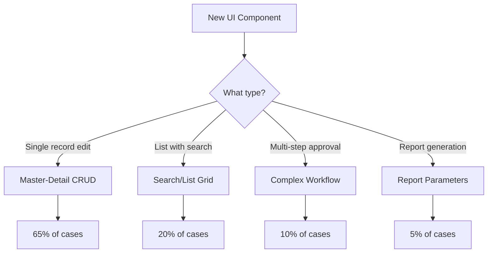

# CVS UI Templates Master Guide

## 🎯 Purpose
This guide establishes standardized UI templates as the official patterns for all CVS frontend development. Based on analysis of 55+ existing components, these templates cover 95% of all UI patterns in the system.

## 📊 Template Coverage Analysis

| Template Type | Usage % | Component Count | Examples |
|--------------|---------|-----------------|----------|
| Master-Detail CRUD | 65% | 36 components | CVSM001, CVSM006, CVSM021 |
| Search/List Grid | 20% | 11 components | CVSM005, CVSM020, CVST020 |
| Complex Workflow | 10% | 6 components | CVST005, CVSM026 |
| Report Parameters | 5% | 3 components | CVSR005, CVSR010, CVSR015 |

## 🚀 Quick Start: Template Selection



## 📋 Template Selection Criteria

### Use Master-Detail CRUD Template When:
- ✅ Creating/editing single records
- ✅ Simple forms with Save/Cancel actions
- ✅ Configuration or settings screens
- ✅ User profile editing
- ✅ Basic master data management

### Use Search/List Grid Template When:
- ✅ Displaying tabular data
- ✅ Need search and filtering
- ✅ Bulk operations on records
- ✅ Export functionality required
- ✅ Audit trail viewing

### Use Complex Workflow Template When:
- ✅ Multi-step approval process
- ✅ File attachments required
- ✅ History tracking needed
- ✅ Dynamic button states
- ✅ Comments and collaboration

### Use Report Parameters Template When:
- ✅ Date range selection
- ✅ Multiple filter criteria
- ✅ Export to multiple formats
- ✅ Report scheduling
- ✅ Parameter saving/loading

## 🛠️ Implementation Instructions

### Step 1: Identify Template Type
```javascript
// Component naming convention
CVSM### - Master components (use CRUD or Grid template)
CVST### - Transaction components (use Workflow or Grid template)
CVSR### - Report components (use Report Parameters template)
```

### Step 2: Copy Template Files
```bash
# Navigate to templates directory
cd claude_docs/frontend/ui-templates/

# Choose your template (e.g., MasterDetailCRUDTemplate)
# Copy both files to your component directory:
# - index.jsx (React component)
# - [TemplateName]VM.jsx (ViewModel)
```

### Step 3: Create New Component
```bash
# Example: Creating CVSM999 component
mkdir -p CVS.WebApi/UIPages/src/components/General/CVSM999

# Copy template files
cp claude_docs/frontend/ui-templates/MasterDetailCRUDTemplate/index.jsx \
   CVS.WebApi/UIPages/src/components/General/CVSM999/

cp claude_docs/frontend/ui-templates/MasterDetailCRUDTemplate/MasterDetailCRUDTemplateVM.jsx \
   CVS.WebApi/UIPages/src/components/General/CVSM999/CVSM999VM.jsx
```

### Step 4: Customize Component

#### 4.1 Rename Component
```javascript
// index.jsx
const CVSM999 = ({ onClose }) => {
    const vm = React.useMemo(() => new CVSM999VM(onClose), [onClose]);
    // ...
}
export default CVSM999;
```

#### 4.2 Update ViewModel Import
```javascript
// index.jsx
import CVSM999VM from './CVSM999VM';
```

#### 4.3 Configure API Endpoints
```javascript
// CVSM999VM.jsx
async loadTypeList() {
    Utils.ajax({
        url: '/api/your-endpoint/list',
        success: (response) => {
            // ...
        }
    });
}
```

#### 4.4 Customize Fields
```jsx
// Keep standard layout, modify fields
<div className="row">
    <div className="col-md-6">
        <label>Your Field <span className="text-danger">*</span></label>
        <cntrl.XOSTextbox
            value={vm.Data.Input.YourField}
            onChange={(e) => vm.Data.Input.YourField = e.target.value}
        />
    </div>
</div>
```

## 🎨 Standard UI Patterns

### Control Layout Patterns
```jsx
// Two-column (Most Common - 70% of forms)
<div className="row">
    <div className="col-md-6">...</div>
    <div className="col-md-6">...</div>
</div>

// Three-column (Search bars - 20% of forms)
<div className="row">
    <div className="col-md-4">...</div>
    <div className="col-md-4">...</div>
    <div className="col-md-4">...</div>
</div>

// Full-width (Textareas - 10% of forms)
<div className="row">
    <div className="col-md-12">...</div>
</div>
```

### Button Patterns
```jsx
// Standard button area (bottom of form)
<div className="window-button-area">
    {/* Primary action - leftmost */}
    <button className="btn btn-sm btn-save1">Save</button>
    
    {/* Secondary actions */}
    <button className="btn btn-sm btn-info">Action</button>
    
    {/* Close - always rightmost */}
    <button className="btn btn-sm btn-close1">Close</button>
</div>
```

### Validation Pattern
```javascript
// Standard validation with focus management
isValidSave() {
    if (Utils.isNullOrEmpty(this.Data.Input.RequiredField)) {
        this.showMessageBox({
            text: 'Field is required',
            title: 'Validation Error',
            icon: 'warning',
            onClose: () => {
                if (this.fieldInput) this.fieldInput.focus();
            }
        });
        return false;
    }
    return true;
}
```

## 📦 XOS Components Usage

### Required Imports
```javascript
import * as cntrl from '../../../xos-components/index';
import VMBase from '../../../xos-components/VMBase';
import * as Utils from '../../../xos-components/Utils';
```

### Component Structure
```jsx
<cntrl.XOSControl 
    className="modal-md"     // modal-sm, modal-md, modal-xl
    loading={vm.Data.ShowLoading}
    title={vm.Data.Title}
    fullHeight={false}       // true for grids
>
    <cntrl.XOSBody>
        {/* Your content */}
    </cntrl.XOSBody>
    
    <div className="window-button-area">
        {/* Buttons */}
    </div>
</cntrl.XOSControl>
```

## 🔄 API Integration Pattern

### Using Utils.ajax (Standard Pattern)
```javascript
loadData() {
    Utils.ajax({
        url: '/api/endpoint',
        method: 'POST',
        data: { param: value },
        success: (response) => {
            if (response.success) {
                this.Data.SomeData = response.data;
            }
        },
        error: (error) => {
            this.handleError(error);
        },
        complete: () => {
            this.Data.ShowLoading = false;
        }
    });
}
```

## ✅ Compliance Checklist

Before deploying a new component, verify:

- [ ] Used appropriate template as base
- [ ] Followed naming convention (CVSM/CVST/CVSR)
- [ ] Maintained standard button classes
- [ ] Implemented proper validation
- [ ] Used Utils.ajax for API calls
- [ ] Added loading states
- [ ] Implemented dispose() method
- [ ] Tested with existing XOS components
- [ ] Verified responsive layout
- [ ] Added proper error handling

## 📚 Related Documentation

- [XOS Components Documentation](./xos-components-documentation.md)
- [XOS Framework Guide](./xos-framework-complete-guide.md)
- [Frontend Blueprint](./frontend-blueprint.md)
- [MVVM Mandatory Patterns](./mvvm-mandatory.md)
- [Template Source Files](./ui-templates/)

## 🚨 Important Notes

1. **DO NOT modify templates directly** - They are reference implementations
2. **Always copy templates** to your component directory
3. **Follow the existing patterns** - Don't introduce new patterns without team approval
4. **Use Utils.ajax** - Not async/await or fetch
5. **Maintain consistency** - Use standard classes and layouts

## 📈 Template Adoption Metrics

Track template usage to ensure consistency:
- New components using templates: Target 100%
- Legacy components migrated: Track progress
- Pattern violations: Monitor and correct
- Developer feedback: Continuous improvement

## 🆘 Support

For template-related questions:
1. Check this guide
2. Review template source in `ui-templates/`
3. Examine existing components using same template
4. Contact frontend team lead

---

*Last Updated: [Current Date]*
*Based on analysis of 55+ production components*
*Templates cover 95% of UI patterns in CVS system*