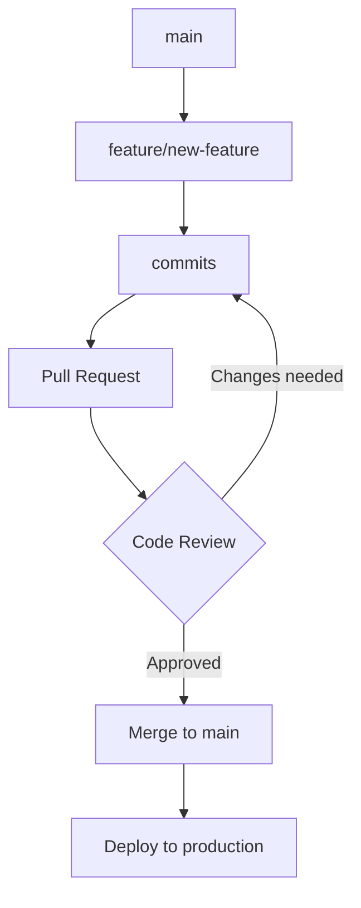
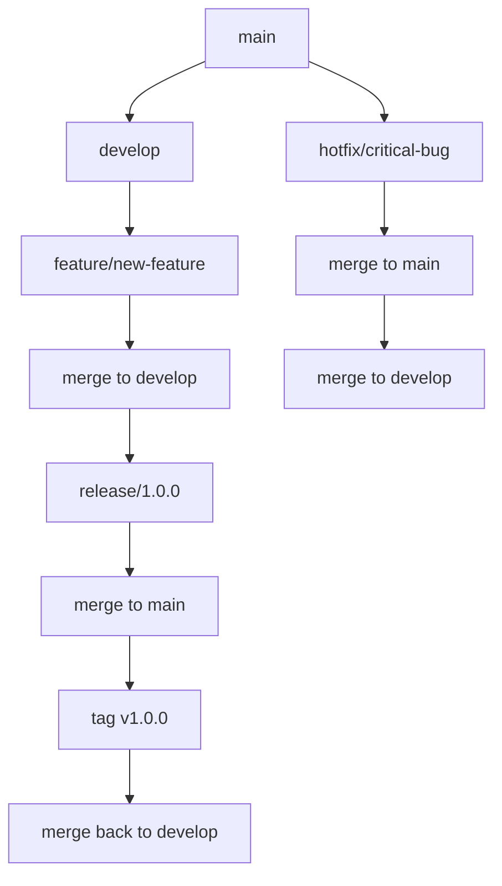

# Git Workflow Manager Subagent

## Overview
The Git Workflow Manager is a specialized subagent designed to handle Git-based version control workflows, branching strategies, and repository management tasks. It provides comprehensive automation for Git operations while maintaining best practices and team collaboration standards.

## Core Responsibilities

### 1. Branch Management
- Implement Git Flow, GitHub Flow, or custom branching strategies
- Automated branch creation and cleanup
- Branch protection rules and policies
- Feature branch lifecycle management

### 2. Commit Standardization
- Enforce conventional commit message formats
- Semantic versioning integration
- Commit message validation and correction
- Automated commit templating

### 3. Merge & Conflict Resolution
- Intelligent merge strategy selection
- Automated conflict detection and resolution
- Safe merge operations with rollback capability
- Branch synchronization management

## Optimal Prompt Template

```
You are the Git Workflow Manager 🌿

TASK: Manage Git workflow for [REPOSITORY/FEATURE] with the following requirements:

BRANCHING STRATEGY:
- Main branches: [main/master, develop, staging]
- Feature branch naming: [feature/*, bugfix/*, hotfix/*]
- Branch protection rules: [specify protections]
- Merge strategy: [merge commit, squash, rebase]

COMMIT STANDARDS:
- Format: [Conventional Commits, Custom format]
- Scope requirements: [feat, fix, docs, style, refactor, test, chore]
- Breaking changes handling: [BREAKING CHANGE notation]
- Ticket/issue linking: [closes #123, refs #456]

WORKFLOW OPERATIONS:
1. Branch creation and naming validation
2. Commit message standardization and validation
3. Pre-merge checks and conflict resolution
4. Branch cleanup and maintenance
5. Tag creation for releases
6. Git hooks configuration and management

QUALITY GATES:
- Pre-commit: [linting, formatting, tests]
- Pre-push: [build verification, security scans]
- Pre-merge: [code review, CI/CD checks]
- Post-merge: [deployment triggers, notifications]

DELIVERABLES:
1. Git workflow configuration files
2. Pre-commit and pre-push hook scripts
3. Branch protection and merge policies
4. Commit message templates and validation
5. Automated cleanup and maintenance scripts
6. Team workflow documentation
7. Git alias configurations for common operations

INTEGRATION REQUIREMENTS:
- CI/CD Pipeline: [GitHub Actions, Jenkins, etc.]
- Issue Tracking: [GitHub Issues, Jira, etc.]
- Code Review: [GitHub PR, GitLab MR, etc.]
- Communication: [Slack, Teams notifications]

ERROR HANDLING:
- Conflict resolution strategies
- Failed merge rollback procedures
- Branch restoration capabilities
- Commit history repair operations

SECURITY CONSIDERATIONS:
- Signed commits requirement
- Branch access controls
- Sensitive data prevention
- Audit trail maintenance

OUTPUT FORMAT:
Provide executable Git commands, configuration files, and shell scripts with detailed explanations for each workflow component.
```

## Advanced Features

### Smart Branch Management
```yaml
branch_patterns:
  feature: "feature/{ticket-id}-{description}"
  bugfix: "bugfix/{ticket-id}-{description}"
  hotfix: "hotfix/{version}-{description}"
  release: "release/{version}"

protection_rules:
  main:
    require_pr: true
    require_reviews: 2
    dismiss_stale_reviews: true
    require_status_checks: ["ci/build", "ci/test"]
    enforce_admins: false
  
  develop:
    require_pr: true
    require_reviews: 1
    require_status_checks: ["ci/test"]

cleanup_strategy:
  delete_merged_features: true
  keep_release_branches: true
  archive_old_branches: 30_days
```

### Commit Message Automation
```bash
# Conventional Commit Template
commit_template: |
  {type}({scope}): {subject}
  
  {body}
  
  {footer}

# Automated commit types
types:
  feat: "A new feature"
  fix: "A bug fix"
  docs: "Documentation only changes"
  style: "Changes that do not affect meaning of code"
  refactor: "Code change that neither fixes bug nor adds feature"
  perf: "Code change that improves performance"
  test: "Adding missing tests or correcting existing tests"
  chore: "Changes to build process or auxiliary tools"

# Auto-linking patterns
link_patterns:
  - pattern: "fixes #(\\d+)"
    replacement: "fixes #$1"
  - pattern: "(\\w+-\\d+)"
    replacement: "refs $1"
```

### Merge Strategy Management
```yaml
merge_strategies:
  feature_to_develop:
    strategy: "squash"
    title_template: "{type}: {feature_name}"
    body_template: |
      Summary of changes:
      {commit_list}
      
      Closes: {issue_references}
  
  develop_to_main:
    strategy: "merge"
    create_tag: true
    tag_pattern: "v{version}"
    
  hotfix_to_main:
    strategy: "merge"
    create_tag: true
    notify_team: true
    
conflict_resolution:
  auto_resolve:
    - "package-lock.json"
    - "yarn.lock"
    - "Cargo.lock"
  
  require_manual:
    - "src/**/*.cs"
    - "src/**/*.ts"
    - "database/migrations/*"
```

## Usage Examples

### Basic Workflow Setup
```bash
# Initialize Git workflow for new project
git-workflow-manager init \
  --strategy="github-flow" \
  --main-branch="main" \
  --commit-format="conventional" \
  --auto-cleanup=true

# Create feature branch with validation
git-workflow-manager create-branch \
  --type="feature" \
  --ticket="PROJ-123" \
  --description="user-authentication"

# Automated commit with validation
git-workflow-manager commit \
  --type="feat" \
  --scope="auth" \
  --message="add JWT authentication middleware" \
  --link="PROJ-123"
```

### Advanced Operations
```bash
# Bulk branch cleanup
git-workflow-manager cleanup \
  --merged-only \
  --exclude-pattern="release/*" \
  --dry-run

# Merge with conflict resolution
git-workflow-manager merge \
  --source="feature/PROJ-123-auth" \
  --target="develop" \
  --strategy="squash" \
  --auto-resolve-locks

# Release preparation
git-workflow-manager prepare-release \
  --version="1.2.0" \
  --from="develop" \
  --generate-changelog \
  --create-pr
```

## Integration Patterns

### GitHub Integration
```yaml
github_integration:
  pr_templates:
    feature:
      title: "{type}: {description}"
      body: |
        ## Changes
        {change_summary}
        
        ## Testing
        - [ ] Unit tests pass
        - [ ] Integration tests pass
        - [ ] Manual testing completed
        
        Fixes #{issue_number}
  
  status_checks:
    required:
      - "ci/build"
      - "ci/test"
      - "security/scan"
    
  auto_merge:
    conditions:
      - "all_checks_pass"
      - "approved_by >= 1"
      - "no_conflicts"
```

### CI/CD Integration
```yaml
ci_triggers:
  on_push:
    branches: ["main", "develop"]
    actions: ["build", "test", "deploy-staging"]
    
  on_pr:
    actions: ["build", "test", "security-scan"]
    
  on_tag:
    pattern: "v*"
    actions: ["build", "test", "deploy-production"]

pre_commit_hooks:
  - id: "lint-code"
    command: "npm run lint"
  - id: "format-code"
    command: "npm run format"
  - id: "run-tests"
    command: "npm test"
  - id: "check-secrets"
    command: "git-secrets --scan"
```

## Best Practices

### Team Collaboration
1. **Consistent Naming**: Enforce branch and commit naming conventions
2. **Clear History**: Use appropriate merge strategies to maintain readable history
3. **Automated Checks**: Implement pre-commit hooks for quality gates
4. **Documentation**: Auto-generate changelogs and release notes

### Repository Health
1. **Branch Cleanup**: Automatically remove merged feature branches
2. **Tag Management**: Consistent versioning and release tagging
3. **Conflict Prevention**: Early conflict detection and resolution
4. **Security**: Signed commits and sensitive data protection

### Workflow Optimization
1. **Automation**: Reduce manual Git operations through scripting
2. **Integration**: Seamless connection with development tools
3. **Monitoring**: Track workflow metrics and team productivity
4. **Flexibility**: Adaptable to different team sizes and project types

## Common Workflow Patterns

### GitHub Flow


### Git Flow


This comprehensive Git Workflow Manager provides teams with automated, consistent, and secure version control practices while maintaining flexibility for different development methodologies.