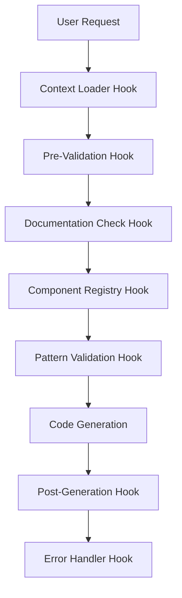

# Claude Code Enterprise Hook System

## Overview
This hook system ensures Claude follows best practices automatically across all projects.

## Hook Execution Order

## Available Hooks

### 1. Context Loader (`context-loader.json`)
- **Triggers**: On session start
- **Purpose**: Loads project-specific context
- **Actions**: 
  - Detects project type
  - Loads relevant documentation
  - Sets active component registry

### 2. Pre-Code Generation (`pre-code-generation.json`)
- **Triggers**: Before any code generation
- **Purpose**: Validates request against rules
- **Actions**:
  - Checks documentation
  - Verifies component availability
  - Validates patterns

### 3. Component Registry (`component-registry.json`)
- **Triggers**: When using UI components
- **Purpose**: Ensures components exist
- **Actions**:
  - Checks available exports
  - Suggests alternatives
  - Prevents compilation errors

### 4. Pattern Validator (`pattern-validator.json`)
- **Triggers**: During code generation
- **Purpose**: Enforces coding patterns
- **Actions**:
  - Validates MVVM structure
  - Checks naming conventions
  - Ensures proper imports

### 5. Error Handler (`error-handler.json`)
- **Triggers**: On compilation/runtime errors
- **Purpose**: Documents and learns from errors
- **Actions**:
  - Logs error to ISSUES_AND_FIXES.md
  - Updates component registry
  - Suggests solutions

## How Hooks Work

Each hook is a JSON configuration that tells Claude:
1. **WHEN** to activate (trigger conditions)
2. **WHAT** to check (validation rules)
3. **HOW** to respond (actions to take)
4. **WHERE** to look (documentation paths)

## Integration with Claude

Claude will:
1. Load all hooks on session start
2. Execute relevant hooks based on triggers
3. Follow hook directives before proceeding
4. Update hooks based on discoveries

## Benefits

- ✅ Prevents component availability errors
- ✅ Enforces consistent patterns
- ✅ Auto-documents issues and solutions
- ✅ Shares knowledge across projects
- ✅ Reduces debugging time
- ✅ Improves code quality

## Usage

Simply having these hooks in `claude_docs/hooks/` enables them.
Claude will automatically detect and use them.