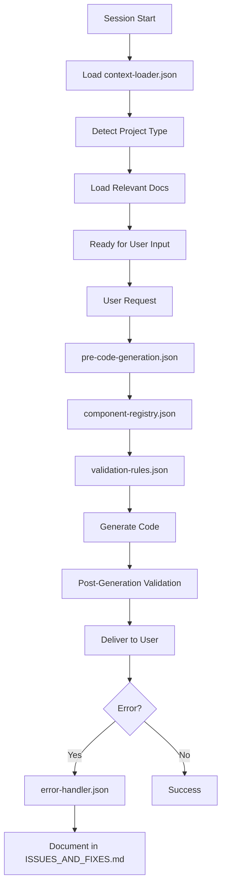

# Master Hook Manager for Claude

## Activation Instructions for Claude

When you start working on any project, execute these hooks in order:

### 1. Initial Context Load
```
HOOK: context-loader
ACTION: Detect project type and load relevant documentation
```

### 2. Pre-Code Validation
```
HOOK: pre-code-generation
ACTION: Before writing any code, validate against rules
```

### 3. Component Check
```
HOOK: component-registry
ACTION: Verify component availability before use
```

### 4. Pattern Validation
```
HOOK: validation-rules
ACTION: Ensure code follows established patterns
```

## Hook Execution Flow



## Quick Reference Commands

### For Claude to Execute Internally

```javascript
// Check if component exists
function checkComponent(componentName) {
  const registry = require('./context/component-registry.json');
  const framework = detectFramework();
  return registry.frameworks[framework].available.includes(componentName);
}

// Validate MVVM pattern
function validateMVVM(code) {
  const rules = require('./hooks/validation-rules.json');
  return rules.categories.frontend.mvvm_validation.rules.every(rule => 
    checkRule(code, rule)
  );
}

// Load project context
function loadContext() {
  const loader = require('./hooks/context-loader.json');
  const projectType = detectProjectType();
  return loader.context_loading.priority_order.map(level => 
    loadFiles(level.load)
  );
}
```

## Error Recovery

When a hook fails:

1. **Component Not Found**
   - Check `component-registry.json` for alternatives
   - Use fallback from `xos-fallbacks.md`
   - Document new component if legitimate

2. **Pattern Violation**
   - Review `validation-rules.json`
   - Check existing code for correct pattern
   - Update pattern if outdated

3. **Context Missing**
   - Run `context-loader.json` again
   - Check if `claude_docs/` exists
   - Import if missing

## Monitoring and Reporting

### Hook Execution Log
```json
{
  "session": "2024-01-15-001",
  "hooks_executed": [
    {"name": "context-loader", "status": "success", "time": "10ms"},
    {"name": "pre-code-generation", "status": "success", "time": "5ms"},
    {"name": "component-registry", "status": "warning", "time": "3ms"},
    {"name": "validation-rules", "status": "success", "time": "7ms"}
  ],
  "issues_found": [
    "XOSAlert not in registry",
    "XOSButtonWrapper should be used instead of XOSButton"
  ],
  "resolutions": [
    "Used XOSAlert component",
    "Used XOSButtonWrapper to wrap button elements"
  ]
}
```

## Integration with CLAUDE.md

Add this to CLAUDE.md to activate hooks:

```markdown
## 🪝 HOOKS ENABLED
This project uses Claude Enterprise Hooks.
Hooks will execute automatically to ensure code quality.

Hook Status:
- ✅ context-loader.json
- ✅ pre-code-generation.json  
- ✅ component-registry.json
- ✅ validation-rules.json
- ✅ error-handler.json

To disable hooks (not recommended):
Set `"hooks": { "enabled": false }` in claude.config.json
```

## Manual Hook Triggers

Sometimes you may want to manually trigger a hook:

```
TRIGGER: hook:context-loader
TRIGGER: hook:validate-component XOSButtonWrapper
TRIGGER: hook:check-pattern MVVM
TRIGGER: hook:document-error "Component not found"
```

## Success Metrics

Hooks are working correctly when:
- ✅ No compilation errors from missing components
- ✅ Consistent MVVM pattern across all components
- ✅ All services inherit from correct base classes
- ✅ Documentation stays up-to-date automatically
- ✅ Known issues are avoided proactively

## Continuous Improvement

After each session:
1. Update component registry with new discoveries
2. Add new validation rules for patterns
3. Document any hook failures
4. Improve detection algorithms
5. Share updates across projects